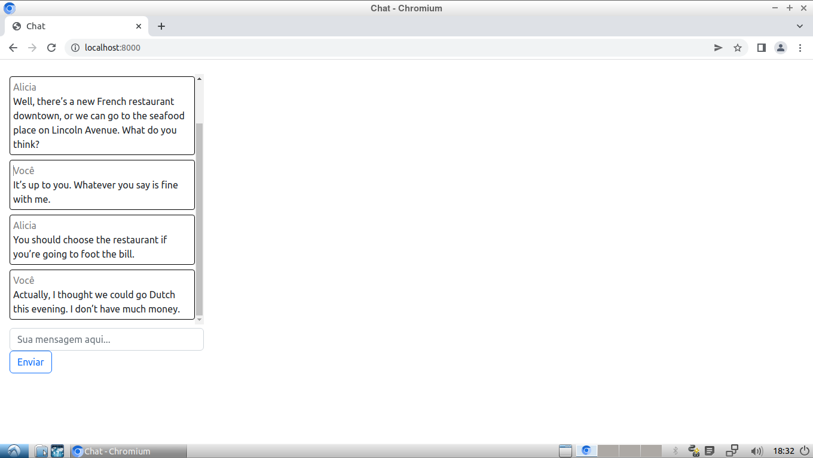

# chat
Um chat escrito em JavaScript (Node.js), Express e Socket.IO.

## Screenshots

## Características
* "'Usuário' está digitando...".
* Salas públicas.
* Salas privadas.
* Design simples e limpo.

## Setup
* Clone este repositório.
* Acesse o repositório pelo terminal.
* Digite os comandos:
  * `npm install`
  * `node index.js`
* Acesse a url http://localhost:8000
